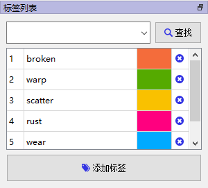

# 使用说明

> 注意事项：
>
> - 以下所有脚本的执行路径都在此项目的根目录
> - 一些脚本中有些路径变量可能要修改


1.将待标注图片放到本地某文件夹下,如`E:/Images`中

2.调用脚本`scripts\bmp2jpg.py`将所有图片转为jpg格式

3.调用脚本`scripts\rename.py`对所有图片重命名

4.打开`eiseg`软件进行标注（通过`pip install eiseg`可以直接下载），数据格式选择XML和COCO(选COCO后才能查看标注过的图片的label)

5.导入标签列表,选择`exported_labels\rope_labels.txt`

如果没有则手动在右侧标签列表添加标签，如下图所示：



并点击工具栏->标注->导出标签列表，将标签文件导出到`./exported_labels`文件夹下


6.创建VOC和YOLO格式的数据集的文件夹

```bash
python ./scripts/makedirs.py
```

执行后会得到如下目录结构：

```
├───VOC
│   ├───Annotations
│   └───JPEGImages
└───YOLO_Format
    ├───images
    │   ├───test
    │   ├───train
    │   └───val
    └───labels
        ├───test
        ├───train
        └───val
```

6.标注好后，将`E:/Images/label/VOC/`文件夹内的所有`.xml`文件放到`./VOC/Annotations`下,将所有`.jpg`图片放到`./VOC/JPEGImages`下


7.调用脚本`scripts\xml2txt.py`将标签的格式转为YOLO格式。需要注意的是，此脚本中的“classes”列表需要按照标注时候的顺序填写标签名称:

```
classes = ['broken', 'warp', 'scatter', 'rust', 'wear']
```


8.调用脚本`scripts\split_data.py`将数据集划分为训练集、验证集、测试集


9.修改`data.yaml`中的`path`和`names`字段：

- `path`：`YOLO_Format`文件夹的绝对路径
- `names`：需要与用eiseg进行标注时，各个label的顺序一致


10.调用脚本`scripts\train.py`即可开始训练YOLOv8模型

11.调用脚本`scripts\export.py`导出onnx格式的模型